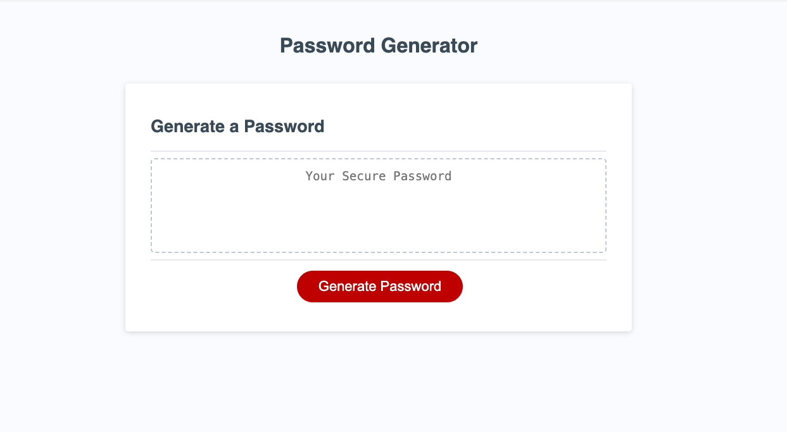
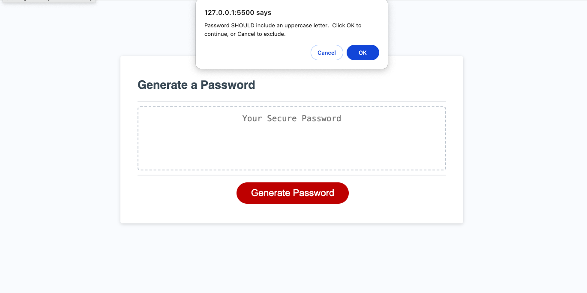
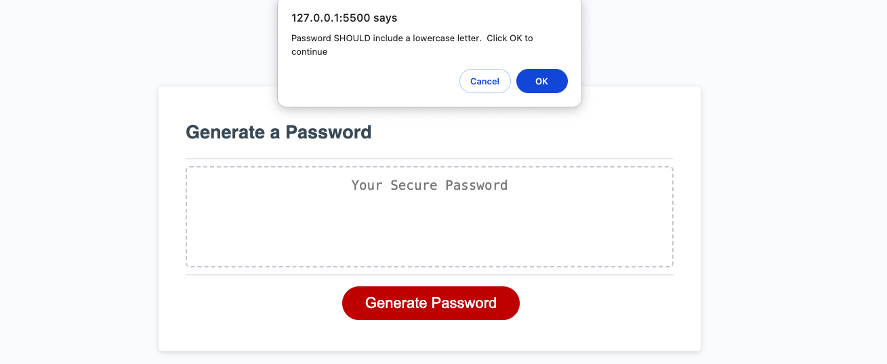
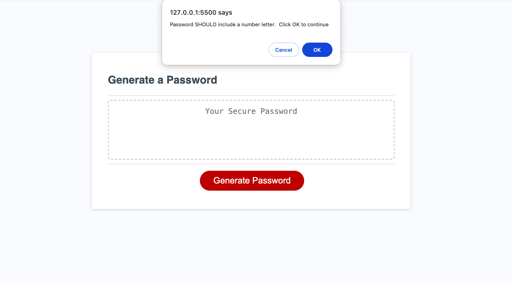
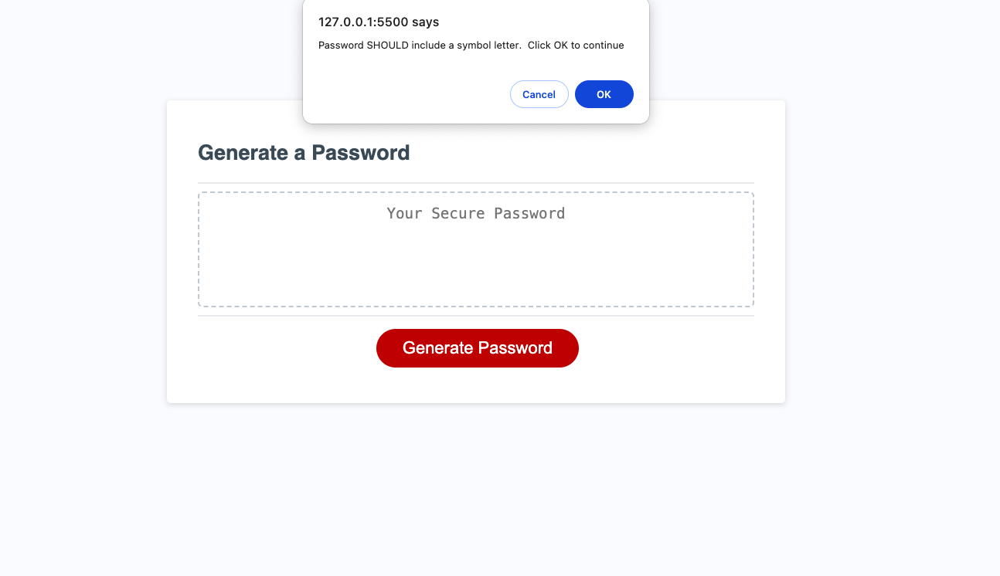
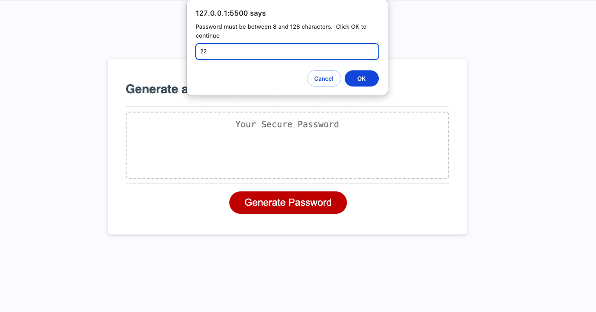
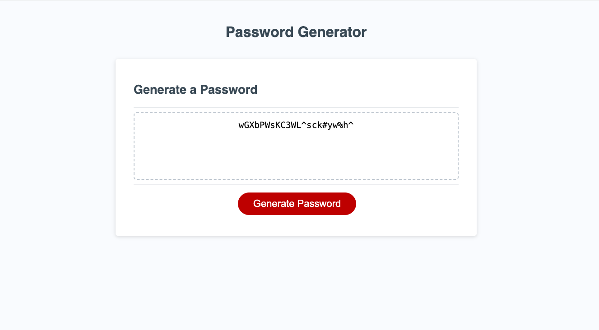

# bring-me-the-pw-03

Random Password Generator

## Table of Content

## Description

Users may find they want or need to have passwords randomly generated for them as it can help to create a stronger security for them. This app takes into account their personal preferences of characters that are needed for a password and generates one for them.

## Usage

<Provide instructions and examples for use. Include screenshots as needed.>
App instructions begin with loading the app from the provided URL.  Then click 'Generate Password' button.  This will give a pop up window that will prompt the user to choose the characters they want in their password.  They have the choices from 'uppercase' and 'lowercase letters, 'numbers and 'special characters'.  Once through these first choices the final prompt will have the user choose how long the password should be, ranging from 8 - 128 characters.  Once number of characters is chosen, the password will be generated.  The user can then copy and paste their newly generated password to their chosen location.

## Acknowledgments

Referenced following websites:

- https://codetheweb.blog/
- https://stackoverflow.com
- https://www.w3schools.com
- https://forum.codewithmosh.com/
- Special thanks to Xpert, the AI Learning Assistant, for providing valuable assistance and guidance.

## License

---MIT License

Copyright (c) [2023] [Christopher Robert Naro]

Permission is hereby granted, free of charge, to any person obtaining a copy
of this software and associated documentation files (the "Software"), to deal
in the Software without restriction, including without limitation the rights
to use, copy, modify, merge, publish, distribute, sublicense, and/or sell
copies of the Software, and to permit persons to whom the Software is
furnished to do so, subject to the following conditions:

The above copyright notice and this permission notice shall be included in all
copies or substantial portions of the Software.

THE SOFTWARE IS PROVIDED "AS IS", WITHOUT WARRANTY OF ANY KIND, EXPRESS OR
IMPLIED, INCLUDING BUT NOT LIMITED TO THE WARRANTIES OF MERCHANTABILITY,
FITNESS FOR A PARTICULAR PURPOSE AND NONINFRINGEMENT. IN NO EVENT SHALL THE
AUTHORS OR COPYRIGHT HOLDERS BE LIABLE FOR ANY CLAIM, DAMAGES OR OTHER
LIABILITY, WHETHER IN AN ACTION OF CONTRACT, TORT OR OTHERWISE, ARISING FROM,
OUT OF OR IN CONNECTION WITH THE SOFTWARE OR THE USE OR OTHER DEALINGS IN THE
SOFTWARE.

🏆 The previous sections are the bare minimum, and your project will ultimately determine the content of this document. You might also want to consider adding the following sections.

## Features

- CSS design
- JavaScript

# Random Password Generator
